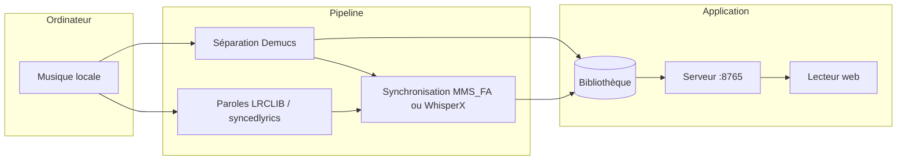

# Karaokit

**Karaoké maison : transforme ta propre musique en karaoké mot à mot, avec playlist et lecture enchaînée, 100 % en local.**


À partir d'un fichier audio (FLAC, MP3, WAV, M4A, OGG, Opus, AAC, WMA), Karaokit sépare
la voix de la musique, récupère les paroles, les synchronise mot à mot et les affiche
dans un lecteur web.

## Sommaire

- [Architecture](#architecture)
- [Documentation](#documentation)
- [Démarrage](#démarrage)
- [Configuration](#configuration)
- [API](#api)
- [Tests](#tests)
- [Structure du projet](#structure-du-projet)
- [Licences et composants](#licences-et-composants)
- [Utilisation de l'application](#utilisation-de-lapplication)
- [Ligne de commande](#ligne-de-commande)
- [Dépannage](#dépannage)

## Architecture

| Composant | Rôle |
|---|---|
| Pipeline Python (`karaoke/`) | Séparation voix / instrumental, recherche et vérification des paroles, synchronisation mot à mot |
| Serveur (`karaoke serve`) | Sert l'application et les fichiers audio, gère la playlist, la file de traitement et la recherche |
| Application web (`web/`) | Playlist, recherche, explorateur de dossiers, lecteur karaoké, éditeur de synchronisation |
| Bibliothèque (`web/public/library/`) | Un dossier par morceau : `instrumental.mp3`, `vocals.mp3`, `lyrics.lrc`, `karaoke.json` |



La synchronisation suit trois niveaux, selon ce qui est trouvé en ligne :

| Niveau | Paroles trouvées | Méthode |
|---|---|---|
| 1 | LRC synchronisé ligne par ligne | Débuts de ligne conservés, mot à mot aligné sur la voix dans chaque ligne |
| 2 | Texte sans horodatage | Alignement forcé du texte sur la voix |
| 3 | Rien de fiable | Transcription automatique de la voix |

Les paroles issues d'une recherche approximative sont vérifiées contre la voix et
rejetées si elles appartiennent à un autre morceau.

## Documentation

| Document | Contenu |
|---|---|
| [docs/CADRAGE.md](docs/CADRAGE.md) | Besoin, périmètre, contraintes, hypothèses, décisions, feuille de route |
| [docs/ARCHITECTURE.md](docs/ARCHITECTURE.md) | Modules, flux de traitement, formats, API, décisions justifiées, sécurité, performances, limites |
| [docs/ETUDE.md](docs/ETUDE.md) | Étude préalable : état de l'art et comparatif des outils existants |

## Démarrage

**Prérequis** : Linux ou WSL2, `curl`, et de préférence une carte NVIDIA (le
fonctionnement sur CPU est possible mais plus lent). Aucun droit administrateur n'est
nécessaire.

```bash
scripts/bootstrap.sh gpu      # ou : scripts/bootstrap.sh cpu
uv run karaoke serve
```

Le script [bootstrap.sh](scripts/bootstrap.sh) installe ffmpeg s'il est absent (build
statique dans `scripts/bin/`), uv, Python 3.12 et les dépendances, Node.js via nvm,
puis construit l'application web. Le premier traitement télécharge les modèles
(Demucs, MMS_FA, Whisper).

| Accès | URL | Note |
|---|---|---|
| Application | http://localhost:8765 | Playlist, recherche, lecteur, éditeur |
| Développement web | http://localhost:5173 | `cd web && npm run dev`, avec `karaoke serve` lancé en parallèle |

## Configuration

Le projet n'utilise pas de variables d'environnement : tout passe par les options de
la ligne de commande.

**`karaoke serve`**

| Option | Défaut | Effet |
|---|---|---|
| `--port` | `8765` | Port d'écoute (sur toutes les interfaces) |
| `--library` | `web/public/library` | Dossier de la bibliothèque |
| `--music` | `~/Music`, `~/Musique`, `C:\Users\<nom>\Music` | Dossier de musique consultable depuis l'application (option répétable) |
| `--device` | `auto` | `auto`, `cpu` ou `cuda` pour les traitements lancés depuis l'application |

**`karaoke build`**

| Option | Défaut | Effet |
|---|---|---|
| `--device` | `auto` | Matériel utilisé |
| `--language` | détection | Code de langue (`fr`, `en`…) |
| `--title`, `--artist` | tags du fichier | Remplace les métadonnées (fichier seul) |
| `--out` | `web/public/library` | Dossier de sortie |
| `--line-only` | désactivé | Garde un LRC ligne par ligne sans mot à mot |
| `--realign` | désactivé | Ignore les horodatages en ligne et ré-aligne tout le texte |
| `--force` | désactivé | Recalcule tout, y compris la séparation |

**`karaoke export`** : `--width` (`1280`) et `--height` (`720`).

Les profils de modèles (GPU / CPU) et les paramètres internes sont décrits dans
[ARCHITECTURE.md](docs/ARCHITECTURE.md#3-stack-technique).

## API

Exposée par `karaoke serve` ; détail des formats dans
[ARCHITECTURE.md](docs/ARCHITECTURE.md#6-serveur-et-api).

| Méthode | Route | Rôle |
|---|---|---|
| `GET` | `/library/<chemin>` | Fichiers de la bibliothèque (requêtes `Range` acceptées) |
| `GET` / `POST` / `PUT` / `DELETE` | `/api/playlist` | Lire, ajouter, réordonner, vider la playlist |
| `DELETE` | `/api/playlist/<id>` | Retirer un titre |
| `GET` | `/api/search?q=` | Rechercher dans la bibliothèque et la musique de l'ordinateur |
| `GET` | `/api/music?path=` | Parcourir un dossier de musique |
| `GET` / `POST` | `/api/jobs` | Suivre / alimenter la file de traitement |
| `DELETE` | `/api/jobs/<id>` | Retirer un traitement en attente |
| `POST` | `/api/jobs/clear` | Effacer les traitements terminés |
| `POST` | `/api/save/<slug>` | Enregistrer une synchronisation corrigée |

## Tests

```bash
uv run --group dev pytest tests/
```

**22 tests unitaires** sur la logique pure (formats, alignement, recherche, vérification
des paroles, service des fichiers, playlist). Test de bout en bout du lecteur dans
Chromium (délai avant le premier son, seek, fluidité, précision du surlignage) :

```bash
uv run --with playwright playwright install chromium
uv run --with playwright python scripts/bench_player.py web/dist web/public/library local
```

Options du test de bout en bout : `--throttle 10` (réseau limité à 10 Mbit/s),
`--cpu 4` (processeur bridé 4 fois).

## Structure du projet

```text
Karaokit/
├── karaoke/                  # pipeline Python et serveur
│   ├── cli.py                # commandes build, list, export, serve
│   ├── pipeline.py           # orchestration d'un morceau ou d'un album
│   ├── separate.py           # séparation voix / instrumental (Demucs)
│   ├── lyrics.py             # recherche des paroles (LRCLIB, syncedlyrics)
│   ├── verify.py             # vérification des paroles contre la voix
│   ├── align.py              # alignement forcé (MMS_FA)
│   ├── transcribe.py         # transcription (WhisperX), types Line / Word
│   ├── lrc.py                # format LRC
│   ├── metadata.py           # titre et artiste
│   ├── export_video.py       # export MP4 avec sous-titres ASS
│   ├── server.py             # serveur HTTP et API
│   ├── jobs.py               # file de traitement
│   ├── playlist.py           # playlist et index de recherche
│   ├── config.py             # profils CPU / GPU
│   └── utils.py              # ffmpeg, écritures atomiques, bibliothèques CUDA
├── web/                      # application React (Vite)
│   ├── src/                  # App, Playlist, Home, Browser, KaraokePlayer…
│   └── public/library/       # bibliothèque générée (pistes non versionnées)
├── scripts/
│   ├── bootstrap.sh          # installation sans droits administrateur
│   ├── bench_player.py       # test de bout en bout du lecteur
│   └── split_existing_lines.py
├── tests/test_core.py        # tests unitaires
├── docs/                     # cadrage, architecture, étude
├── pyproject.toml            # dépendances (variantes gpu / cpu)
└── uv.lock
```

## Licences et composants

| Composant | Rôle | Licence |
|---|---|---|
| Demucs 4.1.0 (modèle `htdemucs_ft`) | Séparation voix / instrumental | MIT |
| PyTorch 2.8.0 | Calcul | BSD-3-Clause |
| torchaudio 2.8.0 (`MMS_FA`) | Alignement forcé | BSD-2-Clause pour le code ; licence des poids MMS à confirmer |
| WhisperX 3.8.6 | Transcription et alignement | BSD-2-Clause |
| faster-whisper 1.2.1 | Moteur Whisper | MIT |
| syncedlyrics 1.0.1 | Recherche de paroles multi-sources | MIT |
| LRCLIB | Base de paroles synchronisées (service en ligne) | Service gratuit ; paroles soumises au droit d'auteur |
| ffmpeg | Décodage, encodage, vidéo | LGPL-2.1+ ou GPL-2.0+ selon la compilation |
| React 18.3.1 | Interface | MIT |
| Vite 5.4 | Build de l'interface | MIT |
| **Karaokit** | Code du projet | MIT — Copyright (c) 2026 floSa (fichier `LICENSE` à ajouter) |

Les instrumentaux, paroles et vidéos générés sont réservés à un **usage personnel** et
ne sont pas versionnés.

## Utilisation de l'application

Après `uv run karaoke serve`, ouvrir http://localhost:8765.

**Playlist (colonne de gauche)**
- Glisser-déposer pour réordonner, croix pour retirer un titre, clic sur un titre prêt pour le chanter.
- Un titre pris sur l'ordinateur est préparé automatiquement, un à la fois ; l'étape en cours s'affiche.
- « Enchaîner les titres » : en fin de chanson, le prochain titre prêt démarre (les titres encore en préparation sont sautés).
- La playlist est enregistrée par le serveur et survit à un rechargement ou à un redémarrage.

**Recherche (centre)**
- Recherche par titre ou artiste, sans tenir compte des accents, dans la bibliothèque (« Prêts à chanter ») et dans la musique de l'ordinateur.
- « + » ajoute un titre ; cocher plusieurs lignes puis « Ajouter à la playlist » en ajoute plusieurs, avec une langue optionnelle.
- « Parcourir l'ordinateur » : explorateur de dossiers, « + Album » ajoute un dossier entier.

**Lecteur**
- Raccourcis : `Espace` lecture / pause, flèches gauche et droite ±5 s, `Début` retour au début.
- « Voix guide » : réintroduit la voix d'origine à volume réglable.
- « Éditer la synchro » : décalage global de ±0,1 s, « Caler la ligne ici » sur l'instant courant, « Enregistrer ».

## Ligne de commande

```bash
uv run karaoke build "morceau.flac"                 # un morceau
uv run karaoke build "/mnt/c/Users/<nom>/Music/Album"   # un album entier
uv run karaoke list                                 # contenu de la bibliothèque
uv run karaoke export <slug>                        # vidéo MP4 ; 'all' pour tous
```

Les pistes séparées sont réutilisées d'un traitement à l'autre : supprimer
`karaoke.json` puis relancer `build` refait uniquement la synchronisation. La durée de
chaque étape est enregistrée dans `karaoke.json` (champ `timings`).

## Dépannage

| Problème | Cause | Solution |
|---|---|---|
| `ffmpeg introuvable` | ffmpeg absent du système | Relancer `scripts/bootstrap.sh` (installe un build statique) |
| `Library libcublas.so.12 is not found` | ctranslate2 ne trouve pas les bibliothèques CUDA des paquets pip | Géré par `utils.preload_cuda_libs()` ; vérifier la variante GPU : `uv sync --extra gpu` |
| PyTorch ne voit pas le GPU | Pilote trop ancien pour CUDA 12.8 | Adapter l'index `pytorch-cu128` dans [pyproject.toml](pyproject.toml) |
| Paroles d'un autre morceau ou absentes | Tags incorrects, ou version différente de la fiche en ligne | Corriger les tags, ou passer `--title` / `--artist` / `--language` |
| Mots décalés | LRC communautaire imprécis | Éditeur du lecteur, ou `build --realign` |
| Le seek repart au début | Application servie par un autre serveur que `karaoke serve` | Utiliser `karaoke serve` (gère les requêtes `Range`) |
