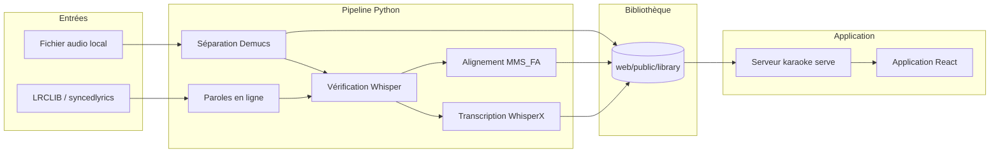
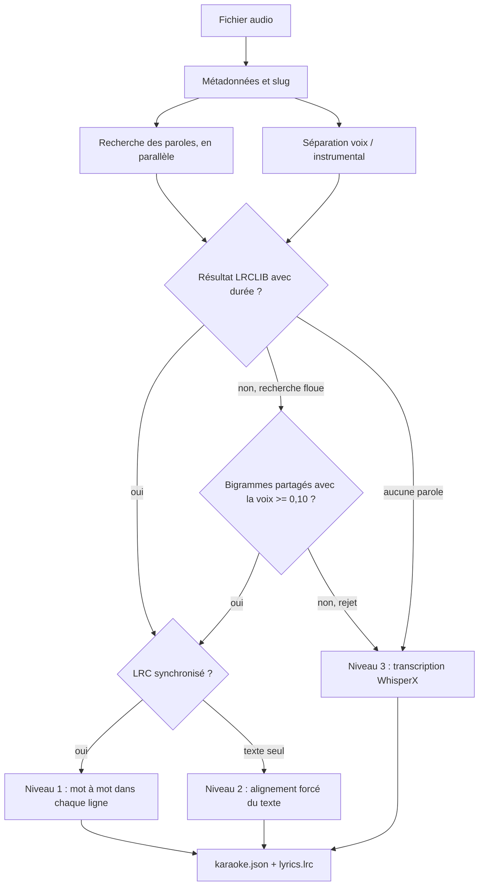
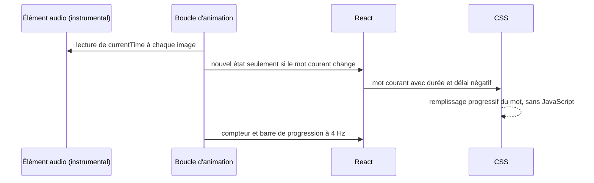

# Architecture — Karaokit

Ce document décrit le **comment** : composants, flux de données, formats, API,
décisions techniques et limites. Le **pourquoi** (objectifs, périmètre, hypothèses)
est dans [CADRAGE.md](CADRAGE.md) ; l'installation et l'usage sont dans le
[README](../README.md).

## Sommaire

1. [Vue d'ensemble](#1-vue-densemble)
2. [Composants](#2-composants)
3. [Stack technique](#3-stack-technique)
4. [Traitement d'un morceau](#4-traitement-dun-morceau)
5. [Formats de données](#5-formats-de-données)
6. [Serveur et API](#6-serveur-et-api)
7. [Application web](#7-application-web)
8. [Décisions d'architecture](#8-décisions-darchitecture)
9. [Sécurité](#9-sécurité)
10. [Performances mesurées](#10-performances-mesurées)
11. [Limites connues et pistes](#11-limites-connues-et-pistes)

---

## 1. Vue d'ensemble

Karaokit est une application **locale** composée de deux parties :

- un **pipeline Python** (package `karaoke`) qui transforme un fichier audio en
  karaoké : séparation voix / instrumental, récupération des paroles,
  synchronisation mot à mot ;
- une **application web React**, servie par un petit serveur Python, qui gère la
  playlist, la recherche de morceaux et le lecteur karaoké.

Le pipeline écrit **un dossier par morceau** dans `web/public/library/<slug>/`.
L'application web ne fait que lire ces fichiers ; elle ne sollicite Python que pour
la playlist, la file de traitement, la recherche et l'éditeur de synchronisation.



---

## 2. Composants

### 2.1 Pipeline Python (`karaoke/`)

| Module | Rôle |
|---|---|
| [cli.py](../karaoke/cli.py) | Interface en ligne de commande `karaoke {build, list, export, serve}`. |
| [config.py](../karaoke/config.py) | Détection CPU / GPU et profils de modèles. |
| [pipeline.py](../karaoke/pipeline.py) | Orchestration d'un morceau ou d'un album, cache des pistes, chronométrage des étapes. |
| [metadata.py](../karaoke/metadata.py) | Titre et artiste depuis les tags (ffprobe), sinon depuis le nom de fichier et l'arborescence. |
| [separate.py](../karaoke/separate.py) | Séparation voix / instrumental avec Demucs, encodage MP3. |
| [lyrics.py](../karaoke/lyrics.py) | Recherche des paroles : LRCLIB direct avec la durée, puis syncedlyrics. |
| [verify.py](../karaoke/verify.py) | Contrôle que des paroles non fiables correspondent bien à la voix. |
| [lrc.py](../karaoke/lrc.py) | Lecture et écriture du format LRC (standard et mot à mot). |
| [align.py](../karaoke/align.py) | Alignement forcé MMS_FA : texte complet, ou mot à mot dans des lignes déjà synchronisées. |
| [transcribe.py](../karaoke/transcribe.py) | Transcription et alignement WhisperX ; types partagés `Line` / `Word`. |
| [export_video.py](../karaoke/export_video.py) | Export d'une vidéo MP4 avec sous-titres ASS à effet karaoké. |
| [server.py](../karaoke/server.py) | Serveur HTTP (bibliothèque standard) : application, fichiers audio, API. |
| [jobs.py](../karaoke/jobs.py) | File de traitement exécutée dans un thread de fond du serveur. |
| [playlist.py](../karaoke/playlist.py) | Playlist enregistrée et index de recherche de la musique de l'ordinateur. |
| [utils.py](../karaoke/utils.py) | ffmpeg / ffprobe, durée, écriture atomique, chargement des bibliothèques CUDA. |

### 2.2 Application web (`web/src/`)

| Fichier | Rôle |
|---|---|
| [App.jsx](../web/src/App.jsx) | Mise en page (playlist à gauche, contenu au centre), routage, enchaînement des titres. |
| [Playlist.jsx](../web/src/Playlist.jsx) | Colonne playlist : glisser-déposer, retrait, état de préparation, lecture au clic. |
| [usePlaylist.js](../web/src/usePlaylist.js) | Synchronisation de la playlist avec le serveur. |
| [Home.jsx](../web/src/Home.jsx) | Recherche, bibliothèque, sélection multiple. |
| [Browser.jsx](../web/src/Browser.jsx) | Explorateur des dossiers de musique. |
| [KaraokePlayer.jsx](../web/src/KaraokePlayer.jsx) | Lecteur : audio, surlignage mot à mot, voix guide, éditeur de synchronisation. |
| [Icon.jsx](../web/src/Icon.jsx) | Icônes vectorielles. |
| [api.js](../web/src/api.js) | Accès à l'API (même origine, ou port 8765 en développement). |
| [styles.css](../web/src/styles.css) | Styles de toute l'application. |

### 2.3 Scripts et tests

| Fichier | Rôle |
|---|---|
| [scripts/bootstrap.sh](../scripts/bootstrap.sh) | Installation sans droits administrateur : ffmpeg, uv, dépendances, Node, build web. |
| [scripts/bench_player.py](../scripts/bench_player.py) | Test de bout en bout du lecteur dans Chromium (délai, seek, fluidité, précision). |
| [scripts/split_existing_lines.py](../scripts/split_existing_lines.py) | Migration : redécoupe les lignes trop longues de karaokés déjà produits. |
| [tests/test_core.py](../tests/test_core.py) | Tests unitaires de la logique pure (22 tests). |

---

## 3. Stack technique

| Couche | Technologie | Version |
|---|---|---|
| Langage pipeline | Python | 3.12 (`>=3.12,<3.14`) |
| Gestion des dépendances | uv | `pyproject.toml` + `uv.lock` |
| Calcul | PyTorch / torchaudio | 2.8.0 (CUDA 12.8 ou CPU) |
| Séparation | Demucs, modèle `htdemucs_ft` | 4.1.0 |
| Transcription | WhisperX / faster-whisper | 3.8.6 / 1.2.1 |
| Alignement forcé | torchaudio `MMS_FA` | 2.8.0 |
| Paroles en ligne | LRCLIB (API HTTP), syncedlyrics | syncedlyrics 1.0.1 |
| Audio / vidéo | ffmpeg / ffprobe | système ou build statique |
| Serveur | `http.server` (bibliothèque standard) | Python 3.12 |
| Interface | React | 18.3.1 |
| Build web | Vite | 5.4 |

Profils de modèles choisis par [config.py](../karaoke/config.py) :

| Profil | Séparation | Transcription (niveau 3) | Vérification des paroles | Précision de calcul |
|---|---|---|---|---|
| GPU (`cuda`) | `htdemucs_ft` (sous-modèle voix) | Whisper `large-v3` | Whisper `small` | float16 |
| CPU | `htdemucs_ft` (sous-modèle voix) | Whisper `small` | Whisper `base` | int8 |

---

## 4. Traitement d'un morceau

### 4.1 Déroulé

1. **Identification** : titre et artiste lus dans les tags, slug calculé (`artiste-titre`).
   Si `karaoke.json` existe déjà, le morceau est ignoré (sauf `--force` ou `--realign`).
2. **Recherche des paroles**, lancée immédiatement dans un thread, **en parallèle** de la séparation.
3. **Séparation** : décodage en 44,1 kHz stéréo, extraction de la voix, instrumental
   = mix moins voix, encodage des deux MP3 en parallèle. Réutilisation si les pistes existent.
4. **Vérification** des paroles si elles viennent d'une recherche floue.
5. **Synchronisation** selon le niveau disponible (voir 4.2).
6. **Nettoyage** : aucun mot ne déborde sur le suivant.
7. **Écriture atomique** de `lyrics.lrc`, `karaoke.json`, puis de `index.json`.



### 4.2 Les trois niveaux de synchronisation

| Niveau | Condition | Fonction | Résultat |
|---|---|---|---|
| **1** | LRC synchronisé ligne par ligne trouvé | `align.align_to_lines` | Débuts de ligne conservés, mot à mot aligné dans la fenêtre de chaque ligne |
| **2** | Texte trouvé sans horodatage | `align.align_lyrics` | Texte aligné sur toute la voix, lignes du texte d'origine |
| **3** | Aucune parole fiable | `transcribe.transcribe_and_align` | Paroles transcrites depuis la voix, lignes limitées à **9 mots** |

Le découpage en lignes vient **de la source** : lignes du LRC (niveau 1), retours à
la ligne du texte (niveau 2), segments Whisper recoupés (niveau 3). Les silences ne
provoquent pas de retour à la ligne.

### 4.3 Paramètres du traitement

| Paramètre | Valeur | Emplacement | Effet |
|---|---|---|---|
| Tolérance de durée LRCLIB | **3 s** | [lyrics.py](../karaoke/lyrics.py) | Écart maximal entre la durée du fichier et celle de la fiche LRCLIB |
| Seuil de vérification | **0,10** | [verify.py](../karaoke/verify.py) | Part minimale de bigrammes entendus présents dans les paroles |
| Mots transcrits pour juger | **60** | [verify.py](../karaoke/verify.py) | La transcription de contrôle s'arrête au-delà |
| Fenêtre d'une ligne | **−0,6 s / +0,4 s**, max **12 s** | [align.py](../karaoke/align.py) | Marges autour d'une ligne LRC pour le mot à mot |
| Découpage des émissions | tranches de **30 s**, contexte **5 s** | [align.py](../karaoke/align.py) | Coût linéaire en durée |
| Dérive tolérée (`--realign`) | **1,5 s** médiane | [pipeline.py](../karaoke/pipeline.py) | Au-delà, le ré-alignement est rejeté |
| Recherches de paroles simultanées (album) | **4** | [pipeline.py](../karaoke/pipeline.py) | Requêtes réseau en parallèle |
| Débit instrumental | **256 kbit/s** stéréo | [separate.py](../karaoke/separate.py) | Piste écoutée |
| Débit voix | **96 kbit/s** mono | [separate.py](../karaoke/separate.py) | Voix guide et source de synchronisation |

---

## 5. Formats de données

### 5.1 Dossier d'un morceau

```text
web/public/library/
├── index.json               # liste des morceaux (générée)
├── playlist.json            # playlist de l'application (non versionnée)
└── <slug>/
    ├── instrumental.mp3     # piste à chanter
    ├── vocals.mp3           # voix isolée
    ├── lyrics.lrc           # paroles synchronisées ligne par ligne
    ├── karaoke.json         # source de vérité du lecteur
    ├── karaoke.ass          # après export vidéo
    └── karaoke.mp4          # après export vidéo
```

### 5.2 `karaoke.json`

```json
{
  "slug": "rihanna-unfaithful-album-version",
  "title": "Unfaithful (Album Version)",
  "artist": "Rihanna",
  "duration": 226.97,
  "instrumental": "instrumental.mp3",
  "vocals": "vocals.mp3",
  "lyrics_source": "LRCLIB (LRC synchronisé) + mot-à-mot",
  "wordLevel": true,
  "device": "cuda",
  "timings": { "separation": 7.2, "lyrics_wait": 0.0, "sync": 1.9, "total": 9.16 },
  "lines": [
    { "start": 13.57, "end": 14.9,
      "words": [ { "text": "Story", "start": 13.57, "end": 13.9 } ] }
  ]
}
```

| Champ | Contenu |
|---|---|
| `lines[].words[]` | Mots avec début et fin en secondes ; les mots sont strictement enchaînés |
| `wordLevel` | `true` si au moins une ligne contient plusieurs mots |
| `lyrics_source` | Origine des paroles et méthode de synchronisation |
| `timings` | Durée de chaque étape du traitement, en secondes |
| `edited` | Présent et `true` après une correction dans l'éditeur |
| `video` | Nom du MP4 après `karaoke export` |

### 5.3 `playlist.json`

Liste ordonnée d'éléments `{id, slug, path, title, artist}`. Un élément venant de la
bibliothèque a un `slug` ; un élément venant de l'ordinateur a un `path` et reçoit
son `slug` quand le traitement se termine. Au démarrage du serveur, les éléments non
terminés sont renvoyés en traitement.

---

## 6. Serveur et API

`karaoke serve` démarre un `ThreadingHTTPServer` sur **0.0.0.0:8765**. Il sert
`web/dist` (application construite), `web/public/library` (fichiers audio et JSON) et
l'API. Au démarrage, il lance l'indexation de la musique et prépare la file de traitement.

### 6.1 Endpoints

| Méthode | Route | Rôle |
|---|---|---|
| `GET` | `/` et chemins de l'application | Application web (repli sur `index.html`) |
| `GET` | `/library/<chemin>` | Fichiers de la bibliothèque (requêtes `Range` acceptées) |
| `GET` | `/api/playlist` | Playlist et état de préparation de chaque titre |
| `POST` | `/api/playlist` | Ajoute `{slugs, paths, language}` ; les fichiers partent en traitement |
| `PUT` | `/api/playlist` | Réordonne `{ids}` |
| `DELETE` | `/api/playlist/<id>` | Retire un titre (annule son traitement s'il n'a pas commencé) |
| `DELETE` | `/api/playlist` | Vide la playlist |
| `GET` | `/api/search?q=` | Recherche dans la bibliothèque et dans la musique indexée (60 résultats max) |
| `GET` | `/api/music?path=` | Contenu d'un dossier de musique |
| `GET` | `/api/jobs` | État de la file de traitement |
| `POST` | `/api/jobs` | Ajoute des fichiers ou dossiers à traiter |
| `DELETE` | `/api/jobs/<id>` | Retire un traitement en attente |
| `POST` | `/api/jobs/clear` | Efface les traitements terminés |
| `POST` | `/api/save/<slug>` | Enregistre une synchronisation corrigée (`karaoke.json`, `lyrics.lrc`, `index.json`) |

### 6.2 Service des fichiers

| Mécanisme | Détail |
|---|---|
| Requêtes `Range` | Réponse **206** ; **416** si la plage est invalide |
| Envoi | Par blocs de **256 Ko**, sans charger le fichier en mémoire |
| Connexions | HTTP/1.1 persistant |
| Cache | `ETag` + réponse **304** ; cache long pour `web/dist/assets/` |

### 6.3 File de traitement et index

| Élément | Comportement |
|---|---|
| File (`jobs.JobQueue`) | Un seul thread, un morceau à la fois ; modèles gardés en mémoire ; thread arrêté après **60 s** d'inactivité |
| Étapes publiées | en attente, séparation, recherche des paroles, vérification, synchronisation, écriture |
| Index (`playlist.MusicIndex`) | Parcours complet des dossiers de musique, rafraîchi s'il a plus de **10 min** |
| Dossiers de musique par défaut | `~/Music`, `~/Musique`, `/mnt/c/Users/<nom>/Music` (comptes système Windows exclus) |

---

## 7. Application web

### 7.1 Écrans et routage

| URL | Écran |
|---|---|
| `#/` | Recherche et bibliothèque |
| `#/:parcourir` | Explorateur de dossiers |
| `#/<slug>` | Lecteur du morceau |

La playlist reste affichée à gauche sur tous les écrans (repliable). Elle est
rafraîchie toutes les **1,5 s** tant qu'un titre est en préparation, sinon toutes les **15 s**.

### 7.2 Enchaînement des titres

En fin de chanson, `App.jsx` cherche le **prochain titre prêt** après le titre courant
et le lance. Les titres encore en préparation sont sautés. Le titre suivant est annoncé
dans l'en-tête du lecteur.

### 7.3 Lecteur



| Fonction | Mise en oeuvre |
|---|---|
| Surlignage | Recherche dichotomique de la ligne active, mot courant animé en CSS |
| Voix guide | Deuxième élément audio, créé seulement si le curseur est au-dessus de 0, recalé au-delà de **0,12 s** d'écart |
| Pré-roll | Trois points avant une ligne si le silence précédent dépasse **2,5 s** |
| Raccourcis | Espace : lecture / pause ; flèches : ±5 s ; Début : retour à 0 |
| Éditeur | Décalage global ±0,1 s, calage d'une ligne sur l'instant courant, enregistrement via l'API |

---

## 8. Décisions d'architecture

**Séparation : sous-modèle voix de `htdemucs_ft`**
- **Problème** : `htdemucs_ft` est un ensemble de 4 modèles ; la séparation d'un titre
  de 3 min 47 prenait **31 s** sur GPU.
- **Options** : `htdemucs` (un modèle, qualité moindre), ensemble complet, sous-modèle voix seul.
- **Choix** : exécuter **uniquement le sous-modèle voix** et calculer l'instrumental
  par soustraction, **plutôt que** l'ensemble complet, **parce que** les poids de
  l'ensemble forment une matrice identité (seul le 4e modèle produit la voix). Voix
  identique à **0,04 %**, calcul **4 fois** plus court ; l'instrumental obtenu est le
  complément exact de la voix, alors que la somme des autres pistes perdait environ **9 %** du signal.
- **Limite** : si la voix est mal estimée, les résidus se retrouvent dans l'instrumental.

**Paroles : LRCLIB direct avec la durée, puis recherche floue vérifiée**
- **Problème** : la recherche floue de syncedlyrics a renvoyé les paroles d'une autre
  chanson pour « Les vieux souliers », et l'alignement les a posées sans erreur.
- **Options** : faire confiance au premier résultat ; utiliser le score d'alignement ;
  transcrire la voix et comparer.
- **Choix** : interroger LRCLIB avec **artiste, titre et durée** (fiable), et vérifier
  tout résultat flou par une **transcription Whisper** comparée par **bigrammes**,
  **plutôt que** le score d'alignement CTC, **parce que** ce score ne distingue pas
  les bonnes paroles des mauvaises (mesuré : 0,31 pour des paroles fausses, 0,07 pour
  des paroles justes). Bigrammes mesurés : **0,28 à 0,78** pour les bonnes paroles,
  **0,02 au plus** pour celles d'un autre morceau.
- **Limite** : un titre presque entièrement instrumental (moins de 8 bigrammes entendus)
  n'est pas jugé et les paroles sont acceptées.

**Mot à mot dans la fenêtre de chaque ligne LRC**
- **Problème** : un LRC ligne par ligne ne donne aucun horodatage de mot ; l'ancien
  ré-alignement global dérivait jusqu'à **31 s** sur « La ritournelle ».
- **Choix** : aligner chaque ligne **dans sa fenêtre temporelle** **plutôt que** sur
  tout le morceau, **parce qu'**aucune dérive n'est alors possible. Erreur médiane par
  mot, comparée à Whisper : **0,09 à 0,16 s**, contre **1,0 à 1,4 s** sans mot à mot.
  Des marges plus larges (1,0 s, 1,5 s, 2,5 s) ont été mesurées et dégradent le résultat.
- **Limite** : un LRC communautaire décalé de plus de 0,6 s pénalise l'alignement.

**Émissions MMS_FA par tranches de 30 s**
- **Problème** : l'attention de wav2vec2 est quadratique ; un titre de 7 min 34 coûtait **12,9 s**.
- **Choix** : tranches de 30 s avec 5 s de contexte **plutôt qu'**un bloc unique,
  **parce que** le coût devient linéaire (**3,2 s**) pour une précision identique.

**Serveur en bibliothèque standard**
- **Choix** : `http.server` **plutôt que** FastAPI, **parce que** l'application est
  locale, mono-utilisateur, et qu'aucune dépendance supplémentaire n'est nécessaire.
- **Limite** : pas de validation de schéma ni d'authentification ; le service des
  fichiers (Range, cache) est codé à la main.

**Animation CSS pour le remplissage des mots**
- **Choix** : animation CSS pilotée par la durée du mot **plutôt qu'**un rendu React à
  chaque image, **parce que** React ne se redessine plus qu'au changement de mot
  (environ 3 fois par seconde). Coût mesuré avec un processeur bridé 4 fois : **31 à
  93 ms/s**, contre **107 à 127 ms/s** avant.
- **Limite** : pendant une coupure réseau, l'animation continue alors que l'audio attend.

**Playlist unique enregistrée côté serveur**
- **Choix** : un fichier `playlist.json` **plutôt que** le stockage du navigateur,
  **parce que** la playlist doit survivre à un redémarrage et être la même sur tous
  les appareils du réseau local.
- **Limite** : une seule playlist ; pas de gestion de conflits si deux appareils la modifient en même temps.

**Dépendances gérées par uv**
- **Choix** : `pyproject.toml` avec deux variantes exclusives (`--extra gpu` / `--extra cpu`)
  **plutôt que** deux fichiers `requirements`, **parce que** `uv.lock` rend
  l'installation reproductible.
- **Contrainte** : torch et torchaudio restent en **2.8** (l'alignement forcé de
  torchaudio est retiré en 2.9, et WhisperX 3.8 exige torch 2.8).

---

## 9. Sécurité

Karaokit est conçu pour un **usage domestique sur un réseau de confiance**.

| Point | État actuel | Conséquence |
|---|---|---|
| Écoute réseau | `0.0.0.0:8765` | Accessible depuis les autres machines du réseau local |
| Authentification | Aucune | Toute personne qui atteint le port peut modifier la playlist, lancer des traitements et réécrire une synchronisation |
| CORS | `Access-Control-Allow-Origin: *` | Nécessaire au mode développement (port 5173) |
| Accès aux fichiers | Chemins résolus et limités à la bibliothèque, à `web/dist` et aux dossiers de musique | Les chemins hors de ces racines sont refusés (403 ou 404) |
| Écritures | Fichiers JSON écrits de façon atomique | Pas de fichier partiellement écrit servi au lecteur |
| Droits d'auteur | Pistes et vidéos non versionnées (`.gitignore`) | Ne pas redistribuer les instrumentaux, paroles ou vidéos |
| Données envoyées en ligne | Artiste, titre et durée, vers LRCLIB et les sources de syncedlyrics | Aucun fichier audio ne quitte la machine |

---

## 10. Performances mesurées

Mesures sur **RTX 4060 Ti 16 Go**, avec 5 morceaux réels, avant et après l'audit du 16/09/2026.

| Mesure | Avant | Après |
|---|---|---|
| Séparation d'un titre de 3 min 47 | 31 s | 7 s |
| Album de 3 titres (dont un de 7 min 34) | 126 s, sans mot à mot | 50 s, avec mot à mot et vérification |
| Album de 5 titres | non mesuré | 74 s |
| Erreur médiane par mot, LRC ligne par ligne | 1,0 à 1,4 s | 0,09 à 0,16 s |
| Seek dans le lecteur (`karaoke serve`) | retour à 0 | immédiat (206) |
| Clic vers premier son, Wi-Fi 10 Mbit/s simulé | 0,28 s | 0,32 s |
| Coût du lecteur, processeur bridé 4 fois | 107 à 127 ms/s | 31 à 93 ms/s |

Reproduction : `timings` de chaque `karaoke.json`, et
[scripts/bench_player.py](../scripts/bench_player.py) pour le navigateur.

---

## 11. Limites connues et pistes

| Aspect | Limite actuelle | Piste |
|---|---|---|
| Retours à la ligne | Imposés par la source ; une longue ligne est repliée par le navigateur au milieu d'une phrase | Équilibrer le repli des lignes longues |
| Paroles communautaires | Un LRC décalé ou incomplet est repris tel quel | Correction dans l'éditeur, ou `--realign` |
| Éditeur | Décalage global et calage par ligne uniquement | Édition mot par mot |
| Refrains et chœurs | Voix superposées mal alignées | Correction assistée |
| Langue | Détectée par la transcription de contrôle seulement si elle a lieu | Option de langue par défaut côté serveur |
| Playlist | Une seule playlist ; glisser-déposer indisponible sur mobile | Playlists nommées, boutons monter / descendre |
| File de traitement | En mémoire ; un redémarrage perd les traitements non liés à la playlist | Persister la file |
| Sécurité | Pas d'authentification | Écoute sur `127.0.0.1` par défaut, ou jeton simple |
| Tests | Logique pure et bout en bout manuel ; pas de test automatique du pipeline complet | Petit extrait audio libre de droits pour un test d'intégration |
