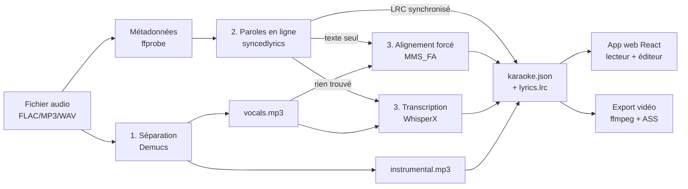

# Architecture de Karaokit

Ce document décrit l'organisation interne du projet : les modules, leur rôle, et
le flux de données de bout en bout. Pour l'usage, voir le [README](../README.md) ;
pour les choix technologiques et l'état de l'art, voir
[karaoke-maison-etude.md](../karaoke-maison-etude.md).

## Vue d'ensemble

Karaokit transforme un fichier audio en karaoké en 4 étapes, puis sert le résultat
à une app web. Le pipeline Python écrit un dossier par morceau ; l'app web le lit.



## Les 3 niveaux de synchronisation

Le cœur de Karaokit est sa **dégradation en douceur** pour couvrir tous les cas :

| Niveau | Condition | Module | Résultat |
|--------|-----------|--------|----------|
| **1** | LRC synchronisé trouvé en ligne | `lyrics` + `lrc` | timecodes récupérés tels quels |
| **2** | Texte trouvé (sans timecodes) | `align` (MMS_FA) | on aligne le texte connu sur la voix |
| **3** | Rien en ligne | `transcribe` (WhisperX) | on transcrit + aligne depuis l'audio |

Le niveau 1 est instantané ; le niveau 2 ne dépend d'aucune synchro préexistante
(seulement du texte) ; le niveau 3 ne dépend d'aucun catalogue.

## Carte des modules (`karaoke/`)

| Module | Rôle |
|--------|------|
| `config.py` | Détection CPU/GPU et profils de modèles (device-agnostique). |
| `utils.py` | Slugify, timecodes LRC, localisation de ffmpeg. |
| `metadata.py` | Titre/artiste depuis les tags FLAC (ffprobe) ou l'arborescence. |
| `separate.py` | **Brique 1** — séparation voix/instrumental via Demucs. |
| `lyrics.py` | **Brique 2** — récupération des paroles en ligne (syncedlyrics). |
| `lrc.py` | Lecture/écriture LRC (standard et « enhanced » mot-à-mot). |
| `align.py` | **Brique 3 / niveau 2** — alignement forcé du texte (torchaudio MMS_FA). |
| `transcribe.py` | **Brique 3 / niveau 3** — transcription + alignement (WhisperX) ; découpage des lignes longues. |
| `pipeline.py` | Orchestration : enchaîne les briques, cache des stems, garde-fou anti-dérive, traitement d'album. |
| `export_video.py` | Export vidéo MP4 (sous-titres ASS avec effet karaoké `\k`). |
| `server.py` | Serveur local (stdlib) : sert l'app + la bibliothèque, sauvegarde les corrections de synchro. |
| `cli.py` / `__main__.py` | Interface `python -m karaoke {build,list,export,serve}`. |

## Structure de données produite

Chaque morceau donne un dossier `web/public/library/<slug>/` :

```
<slug>/
├── instrumental.mp3     # piste à chanter
├── vocals.mp3           # voix isolée (sert à l'alignement)
├── lyrics.lrc           # paroles synchronisées (format universel)
├── karaoke.json         # source de vérité de l'app web (voir ci-dessous)
├── karaoke.ass          # (après export) sous-titres karaoké
└── karaoke.mp4          # (après export) vidéo karaoké
```

`karaoke.json` :

```json
{
  "slug": "hippie-hourrah-revenons-au-debut",
  "title": "Revenons au début",
  "artist": "Hippie Hourrah",
  "instrumental": "instrumental.mp3",
  "vocals": "vocals.mp3",
  "lyrics_source": "en ligne (LRC synchronisé) + ré-aligné mot-à-mot",
  "wordLevel": true,
  "lines": [
    { "start": 7.28, "end": 8.90,
      "words": [ { "text": "Vous", "start": 7.28, "end": 7.40 }, ... ] }
  ]
}
```

`library/index.json` liste tous les morceaux (généré par `pipeline._update_index`).

## Flux de l'app web (`web/`)

- `App.jsx` charge `library/index.json` et affiche la liste.
- `KaraokePlayer.jsx` charge `<slug>/karaoke.json`, joue `instrumental.mp3`
  (+ `vocals.mp3` en voix-guide) et surligne les mots selon `audio.currentTime`.
- **Éditeur** : les corrections sont envoyées en `POST /api/save/<slug>` au serveur
  `karaoke serve`, qui réécrit `karaoke.json` + `lyrics.lrc` + `index.json`.

## Contraintes d'environnement

Le projet a été conçu pour tourner **sans droits admin** :
- **ffmpeg** en build statique (`scripts/bin/`), pas d'installation système.
- **Pas de compilateur C/C++** requis : l'alignement du niveau 2 utilise le moteur
  MMS_FA intégré à torchaudio (wheel précompilé), et non une extension à compiler.
- venv amorcé via `get-pip.py` quand `ensurepip` est absent.

Voir [`scripts/bootstrap.sh`](../scripts/bootstrap.sh).
```
