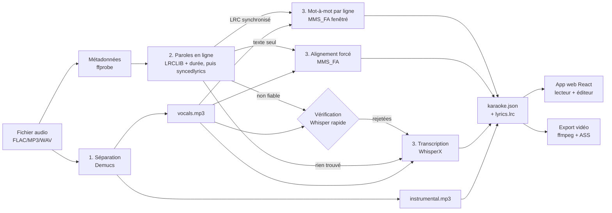

# Architecture de Karaokit

Ce document décrit l'organisation interne du projet : les modules, leur rôle, et
le flux de données de bout en bout. Pour l'usage, voir le [README](../README.md) ;
pour les choix technologiques et l'état de l'art, voir
[karaoke-maison-etude.md](../karaoke-maison-etude.md).

## Vue d'ensemble

Karaokit transforme un fichier audio en karaoké en 4 étapes, puis sert le résultat
à une app web. Le pipeline Python écrit un dossier par morceau ; l'app web le lit.



## Les 3 niveaux de synchronisation

Le cœur de Karaokit est sa **dégradation en douceur** pour couvrir tous les cas :

| Niveau | Condition | Module | Résultat |
|--------|-----------|--------|----------|
| **1** | LRC synchronisé trouvé en ligne | `lyrics` + `lrc` + `align.align_to_lines` | timecodes de ligne conservés, mot-à-mot aligné dans chaque ligne |
| **2** | Texte trouvé (sans timecodes) | `align` (MMS_FA) | on aligne le texte connu sur la voix |
| **3** | Rien en ligne | `transcribe` (WhisperX) | on transcrit + aligne depuis l'audio |

Les paroles issues d'une recherche floue (syncedlyrics) sont **vérifiées contre
l'audio** (`verify.py`) : une transcription Whisper rapide doit partager au moins
10 % de bigrammes avec elles, sinon elles sont rejetées (niveau 3). Mesuré : bonnes
paroles 0,28 – 0,78, paroles d'un autre morceau ≤ 0,02.

Le niveau 1 coûte ~2 s de plus que la séparation ; le niveau 2 ne dépend d'aucune synchro préexistante
(seulement du texte) ; le niveau 3 ne dépend d'aucun catalogue.

## Carte des modules (`karaoke/`)

| Module | Rôle |
|--------|------|
| `config.py` | Détection CPU/GPU et profils de modèles (device-agnostique). |
| `utils.py` | Slugify, timecodes LRC, ffmpeg/ffprobe, durée, pré-chargement cuBLAS/cuDNN. |
| `metadata.py` | Titre/artiste depuis les tags FLAC (ffprobe) ou l'arborescence. |
| `separate.py` | **Brique 1** — séparation via Demucs en processus (sous-modèle voix de `htdemucs_ft`, instrumental = mix − voix). |
| `lyrics.py` | **Brique 2** — paroles en ligne : LRCLIB direct (durée), puis syncedlyrics. |
| `verify.py` | Contrôle que des paroles non fiables correspondent bien à la voix. |
| `lrc.py` | Lecture/écriture LRC (standard et « enhanced » mot-à-mot). |
| `align.py` | **Brique 3 / niveaux 1-2** — alignement forcé MMS_FA : texte entier ou mot-à-mot dans des lignes LRC. |
| `transcribe.py` | **Brique 3 / niveau 3** — transcription + alignement (WhisperX) ; découpage des lignes longues. |
| `pipeline.py` | Orchestration : enchaîne les briques, cache des stems, garde-fou anti-dérive, traitement d'album. |
| `export_video.py` | Export vidéo MP4 (sous-titres ASS avec effet karaoké `\k`). |
| `server.py` | Serveur local (stdlib) : app + bibliothèque (Range 206, flux, ETag), sauvegarde des corrections, explorateur de musique, API de la file. |
| `jobs.py` | File de traitement lancée depuis l'app web (thread de fond, progression par étape). |
| `cli.py` / `__main__.py` | Interface `uv run karaoke {build,list,export,serve}`. |

## Structure de données produite

Chaque morceau donne un dossier `web/public/library/<slug>/` :

```
<slug>/
├── instrumental.mp3     # piste à chanter
├── vocals.mp3           # voix isolée, mono 96 kbit/s (alignement + voix-guide)
├── lyrics.lrc           # paroles synchronisées (format universel)
├── karaoke.json         # source de vérité de l'app web (voir ci-dessous)
├── karaoke.ass          # (après export) sous-titres karaoké
└── karaoke.mp4          # (après export) vidéo karaoké
```

`karaoke.json` :

```json
{
  "slug": "hippie-hourrah-revenons-au-debut",
  "title": "Revenons au début",
  "artist": "Hippie Hourrah",
  "instrumental": "instrumental.mp3",
  "vocals": "vocals.mp3",
  "duration": 212.4,
  "lyrics_source": "LRCLIB (LRC synchronisé) + mot-à-mot",
  "wordLevel": true,
  "timings": { "separation": 7.4, "lyrics_wait": 0.0, "sync": 2.0, "total": 9.5 },
  "lines": [
    { "start": 7.28, "end": 8.90,
      "words": [ { "text": "Vous", "start": 7.28, "end": 7.40 }, ... ] }
  ]
}
```

`library/index.json` liste tous les morceaux (généré par `pipeline._update_index`).

## Flux de l'app web (`web/`)

- `App.jsx` charge `library/index.json` et affiche la liste.
- `KaraokePlayer.jsx` charge `<slug>/karaoke.json`, joue `instrumental.mp3`
  (+ `vocals.mp3`, chargé seulement si la voix-guide est activée) et surligne les
  mots selon `audio.currentTime`. React ne se re-rend qu'au changement de mot ; le
  remplissage progressif du mot en cours est une animation CSS.
- Le morceau ouvert est dans l'URL (`#/<slug>`).
- `AddSongs.jsx` parcourt `GET /api/music?path=…`, compose la liste à traiter et
  l'envoie en `POST /api/jobs` ; `JobsPanel.jsx` suit `GET /api/jobs` (étape, durée,
  erreur) et recharge la bibliothèque quand un morceau est prêt.
- **Éditeur** : les corrections sont envoyées en `POST /api/save/<slug>` au serveur
  `karaoke serve`, qui réécrit `karaoke.json` + `lyrics.lrc` + `index.json`.

## Performances mesurées (RTX 4060 Ti, 5 vrais morceaux)

| | Avant | Après |
|---|---|---|
| Séparation d'un titre de 3 min 47 | 31 s | 7 s |
| Album de 3 titres (dont 7 min 34) | 126 s, sans mot-à-mot | 50 s, mot-à-mot + paroles vérifiées |
| Erreur médiane par mot (vs Whisper) sur un LRC ligne-à-ligne | 1,0 – 1,4 s | 0,09 – 0,16 s |
| Seek dans le lecteur (`karaoke serve`) | repart à 0 | instantané (Range 206) |
| Clic → premier son (Wi-Fi 10 Mbit/s simulé) | 0,28 s | 0,32 s |
| Coût main-thread en lecture (CPU bridé ×4) | 107 – 127 ms/s | 31 – 93 ms/s |

Reproduire : `scripts/bench_player.py` (navigateur) et les `timings` de `karaoke.json`.

## Contraintes d'environnement

Le projet tourne **sans droits admin** :
- Python et dépendances via **uv** (`pyproject.toml`, `uv.lock`) ; variantes `--extra gpu|cpu`.
- **ffmpeg** système ou build statique (`scripts/bin/`).
- **Pas de compilateur C/C++** requis : l'alignement utilise MMS_FA intégré à
  torchaudio (wheel précompilé).

Voir [`scripts/bootstrap.sh`](../scripts/bootstrap.sh).
